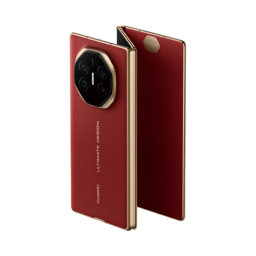
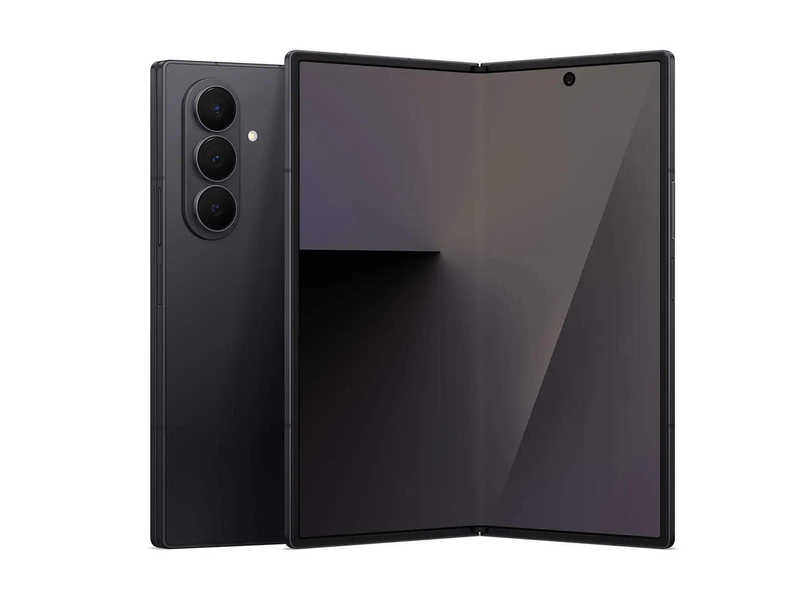
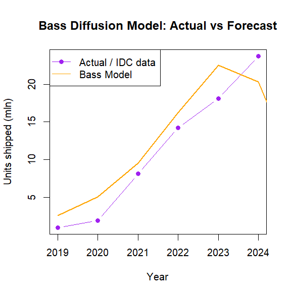

```{r setup, include=FALSE}
knitr::opts_chunk$set(echo = FALSE, warning = FALSE, message = FALSE)
```


## Introduction

This homework analyzes the diffusion of foldable smartphones (2019-2024) using the Bass diffusion model.
The Bass model describes how a new product spreads in the market over time based on innovators (**p**), imitators (**q**), and market potential (**M**).
The innovation selected from *[Time's Best 100 Inventions List (2024)](https://time.com/collection/best-inventions-2024/)* is the tri-fold smartphone (**Huawei MateXT Ultimate Design**).

*Note: the 2024 global shipment figure was derived by taking the share of China's foldable shipments in 2023, dividing it by total global shipments in 2023, and applying the same ration to China's 2024 figure.*

```{r, out.width="60%"}

```


**Huawei MateXT Ultimate Design**

*Source: [Huawei](https://consumer.huawei.com/cn/phones/mate-xt-ultimate-design/?utm_source=a8&utm_medium=affiliate&cid=810001&a8=RVOy6a4rESiyhuwB60lRLSUygOWXEuUXM0lIGDW5LJl7GJjsluWwkDmrMJmXq0lBiSmwltmrLnOsEa4yF0iN4ykKMS5oE4EGH0rM54hKFO52b4bDEa4rq04GEu456u45mJjypS.DlD4EMSWrLVgxxs00000021750001)*


## Innovation Comparison

The Huawei tri-fold smartphone represent the next stage in foldable technology. Earlier foldables were bi-fold devices (also called double-fold), such as the Samsung Galazy Z Fold or Z Flip, which use a single hinge to fold into two segments. These bi-folds transformed the smartphone form factor by offering either a larger book-style screen or a compact clamshell design.

```{r, out.width="60%"}

```

**Samsung Galaxy Z Fold**

*Source: [Samsung](https://www.samsung.com/us/smartphones/galaxy-z-fold7/buy/galaxy-z-fold7-512gb-unlocked-sku-sm-f966uzkexaa/)*

Tri-fold extend this idea by introducing two hinges and three display segments, and these features allow the device to expand into a near-tablet form factor while still folding down into a phone-sized body. Thanks to these features now the screen real estate and multitasking potential is increased, but the downward is that they raise engineering challenges regarding thickness, durability, and hinge reliability.

From a market perspective, bi-folds pioneered the foldable category, and have provided demand for flexible displays despite early skepticism over price and durability. Tri-folds build on that foundation, targeting users who want even more productivity and immersive use cases. Thus, tri-folds can be seen as the evolutionary successors to bi-folds, much like how phablets evolved from early smartphones.


## Data

We use global foldable smartphone shipments (in millions) from IDC (2019-2023) and the calculated 2024 figure. The dataset is stored in `data/`.


## Bass Model Estimation

The Bass model was fit using non-linear least squares (`nls` in R). The estimated parameters are:

* **p** (innovation coefficient) = 0.0303102
* **q** (imitation coefficient) = 1.04512
* **M** (market potential, mln units) = 83.89425


## Forecasting Diffusion

```{r, out.width="60%"}

```

The Bass model captures the expected S-shaped curve of adoption.

* Early phase (2019-2020): shipments were low (<2M units), with the model slightly over-predicting growth.
* Growth phase (2021-2023): strong acceleration due to imitation effects.
* 2024 onward: real shipments (almost 24M) exceeded the Bass prediction, likely due to strong marketing and new foldable launches.


## Scope Justification

We adopt a global scope for analysis. While China is the leading foldable market, shipments are distributed across Asia, Europe, and North America. Global data provides a more representative picture of adoption, avoiding bias from single-country dynamics. Furthermore, most major manufacturers (Samsung, Huawei, Oppo, Motorola) distribute globally, making the worldwide scope the most appropriate.


## Conclusion

* Tri-fold smartphones follow a diffusion path similar to bi-fold smartphones.
* The Bass model predicts steady adoption growth, though real-world factors (marketing, price cuts, tech improvements) may accelerate adoption beyond model expectations.
* Using a global perspective provides a comprehensive view of the category's trajectory.


## Sources

1. [Statista](www.statista.com)
2. [Gizmochina](https://www.gizmochina.com/2022/02/17/foldable-smartphone-shipment-increased-by-264-3-globally/)
3. [IDC](https://my.idc.com/)
4. [Coolest Gadgets](https://coolest-gadgets.com/foldable-phones-statistics/)